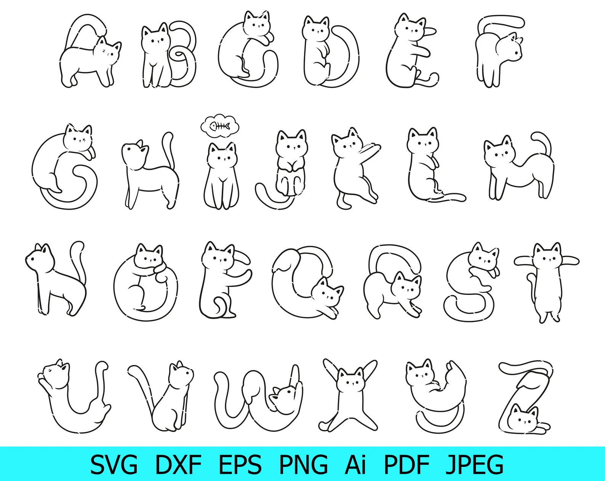
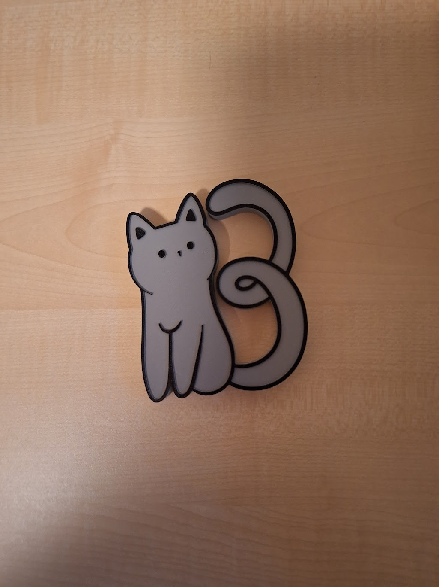
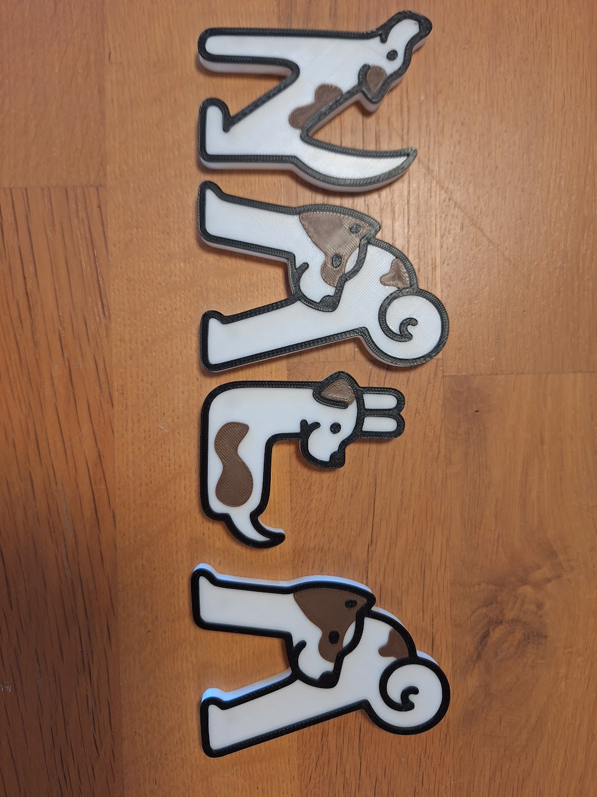

# 3D-projectjes uit het verleden

De beste plek om enkele eenvoudige 3D print projectjes die ik maakte terug te vinden is mijn [Cults3D-pagina](https://cults3d.com/en/users/marlonvalck/3d-models).   

## Dog and cat letters
Magneetletters gebaseerd op katjes of honden. 
Beginnend van de cat and dog fonts

Cat letters voor Bluey:

Dog letters for Nala:

## Large Heart ink bottle rack for tattoo studio
Een nuttig en decoratief stukje voor [cave.blackwork](https://www.instagram.com/caveblackwork/?hl=nl) dat je kan terugvinden in [Hell Leuven](https://helltattooleuven.com/).

(betere foto volgt nog hopelijk)

## Contact

Enthousiast om jouw project aan de lijst toe te voegen? 
Neem [contact](/contact/) op
